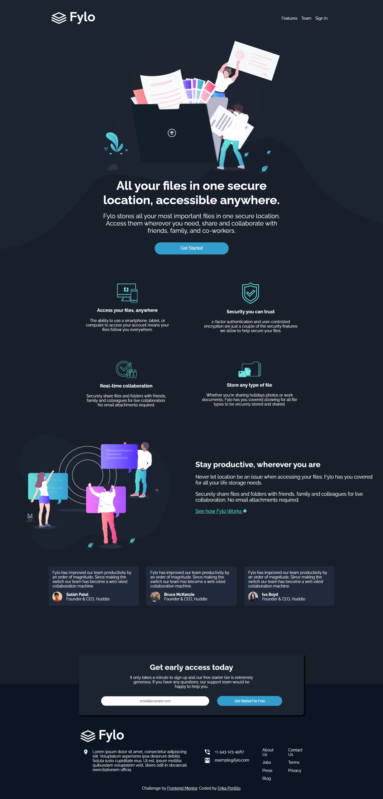
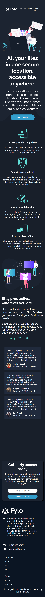

# Frontend Mentor - Fylo dark theme landing page solution

This is a solution to the [Fylo dark theme landing page challenge on Frontend Mentor](https://www.frontendmentor.io/challenges/fylo-dark-theme-landing-page-5ca5f2d21e82137ec91a50fd). Frontend Mentor challenges help you improve your coding skills by building realistic projects.

## Table of contents

- [Overview](#overview)
  - [The challenge](#the-challenge)
  - [Screenshot](#screenshot)
  - [Links](#links)
- [My process](#my-process)
  - [Built with](#built-with)
  - [What I learned](#what-i-learned)
  - [Useful resources](#useful-resources)
- [Author](#author)
- [Acknowledgments](#acknowledgments)

## Overview

### The challenge

Users should be able to:

- View the optimal layout for the site depending on their device's screen size
- See hover states for all interactive elements on the page

### Screenshot

- Desktop Design

  

- Mobile Design

  

### Links

- Solution URL: [https://github.com/erikamp20/fylo-landing-page](https://github.com/erikamp20/fylo-landing-page)
- Live Site URL: [https://erikamp20.github.io/fylo-landing-page/](https://erikamp20.github.io/fylo-landing-page/)

## My process

### Built with

- Semantic HTML5 markup
- CSS custom properties
- Flexbox
- CSS Grid
- Mobile-first workflow

### What I learned

I learned a lot from doing this project. In the first place, I was able to create my own custom properties, and I made different components to make things easier to structure. I put into practice my knowledge of Flexbox, Grid, and responsive design. It was a bit harder to implement the responsive design, but it helped me a lot. 😁

## Author

<!-- - Website - [Add your name here](https://www.your-site.com) -->

- Frontend Mentor - [@erikamp20](https://www.frontendmentor.io/profile/erikamp20)
